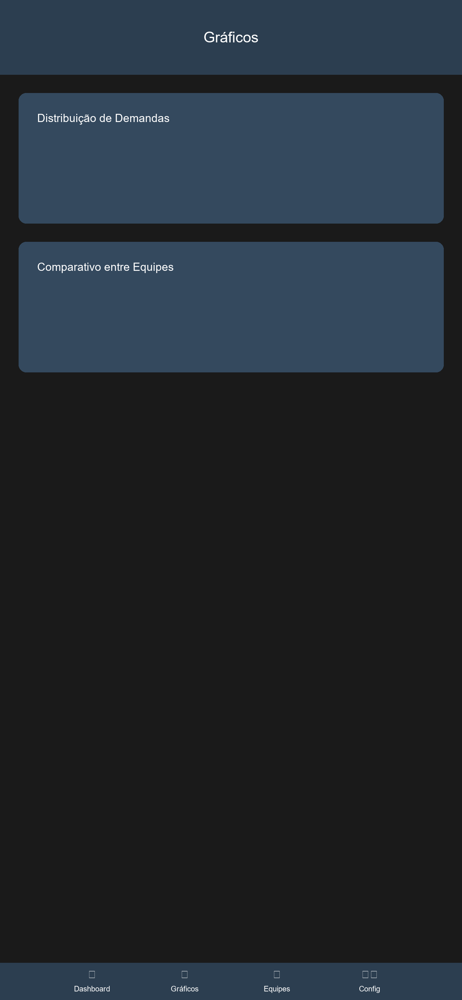

# Sistema de Análise de Demandas

Dashboard profissional para análise e monitoramento de demandas, com foco em métricas de desempenho e insights em tempo real.

[](https://github.com/manfullwel/ddemandreport/actions/workflows/deploy.yml)

## 🔗 Links Importantes

- **[Dashboard](https://manfullwel.github.io/ddemandreport/)**: Acesse o dashboard em funcionamento
- **[Repositório](https://github.com/manfullwel/ddemandreport)**: Código fonte do projeto
- **[Relatório Diário](https://manfullwel.github.io/ddemandreport/)**: Relatório atualizado diariamente

## 🌐 Páginas do Projeto

| Página | Link | Descrição |
|--------|------|-----------|
| 📊 **Dashboard** | [Ver Dashboard](https://manfullwel.github.io/ddemandreport/) | Dashboard principal |
| 📝 **Relatório Diário** | [Ver Relatório](https://manfullwel.github.io/ddemandreport/) | Relatório atualizado diariamente |
| 💻 **Código Fonte** | [GitHub](https://github.com/manfullwel/ddemandreport) | Repositório do projeto |

## 👤 Autor

**Igor Soares (manfullwel)**

* GitHub: [@manfullwel](https://github.com/manfullwel)

## 🙏 Agradecimentos

Um agradecimento especial a todos que contribuíram para este projeto:

* Ediene F.
* Nuno S.
* Victor A.
* Victor C.
* Pablo P.

Suas contribuições e inspirações foram fundamentais para o desenvolvimento deste projeto.

## 👥 Colaboradores

[](https://github.com/manfullwel/ddemandreport/blob/main/docs/images/equipe.png)
- **Equipe de Desenvolvimento**: Implementação e Testes

## 🔧 Configuração do Google Sheets

Para configurar a integração com o Google Sheets, siga estes passos:

1. **Obtenha as Credenciais**:
   - Acesse o [Google Cloud Console](https://console.cloud.google.com)
   - Crie um novo projeto ou selecione um existente
   - Ative a Google Sheets API
   - Crie uma chave de API em "Credenciais"

2. **Configure o Projeto**:
   - Copie o arquivo `config.example.js` para `config.js`
   - Adicione sua chave API no arquivo `config.js`
   - Adicione o ID da sua planilha (encontrado na URL)
   - Ajuste o range conforme sua estrutura de dados

3. **Estrutura da Planilha**:
   A planilha do Google Sheets deve ter as seguintes colunas:

| Coluna | Descrição | Valores Aceitos |
|--------|-----------|-----------------|
| Colaborador | Nome do colaborador responsável | Texto |
| Data | Data do registro | Data (DD/MM/YYYY) |
| Status | Estado atual da demanda | RESOLVIDOS<br>PENDENTE ATIVO<br>PENDENTE RECEPTIVO<br>PRIORIDADE<br>PRIORIDADE TOTAL<br>SOMA DAS PRIORIDADES<br>ANÁLISE<br>ANÁLISE DO DIA<br>RECEPTIVO<br>QUITADO CLIENTE<br>QUITADO<br>APROVADOS |
| Tipo | Tipo de atendimento | Receptivo, Ativo |
| Equipe | Equipe responsável | JULIO, LEANDROADRIANO |

> ⚠️ **Importante**: 
> - Mantenha exatamente os mesmos nomes de colunas e valores aceitos para garantir o funcionamento correto do dashboard
> - Os status devem ser escritos exatamente como mostrado acima, incluindo maiúsculas e acentuação
> - A classificação correta do status é essencial para a geração precisa dos relatórios

4. **Compartilhamento**:
   - Certifique-se de que a planilha está compartilhada com permissão de leitura

## 📱 Versão Mobile (Em Desenvolvimento)

Estamos desenvolvendo uma versão mobile completa do Sistema de Análise de Demandas, que estará disponível para iOS e Android. O aplicativo oferecerá todas as funcionalidades do dashboard web em uma interface otimizada para dispositivos móveis.

### Preview do App Mobile

```
┌─────────── Análise de Demandas ───────────┐
│                                           │
│    ┌───────── Status Atual ──────────┐    │
│    │ ✅ Resolvidos Hoje: 270        │    │
│    │ 📊 Taxa de Resolução: 85%      │    │
│    └─────────────────────────────────┘    │
│                                           │
│    ┌─────── Equipe Julio ───────────┐    │
│    │ Resolvidos: 140               │    │
│    │ [██████████] 85%              │    │
│    │                               │    │
│    │ Pendentes: 102                │    │
│    │ [████████──] 70%              │    │
│    └─────────────────────────────────┘    │
│                                           │
│    ┌── Equipe Adriano/Leandro ────┐    │
│    │ Resolvidos: 130               │    │
│    │ [█████████─] 80%              │    │
│    │                               │    │
│    │ Pendentes: 161                │    │
│    │ [███████───] 60%              │    │
│    └─────────────────────────────────┘    │
│                                           │
│    ┌────── Menu Rápido ─────────┐    │
│    │ [📊] Dashboard  [📈] Gráficos │    │
│    │ [👥] Equipes   [⚙️] Config   │    │
│    └─────────────────────────────────┘    │
│                                           │
└───────────────────────────────────────────┘
```

### Recursos do App Mobile

- **Interface Adaptativa**: Design responsivo que se ajusta a diferentes tamanhos de tela
- **Gestos Intuitivos**: Navegação por gestos para uma experiência fluida
- **Modo Offline**: Acesso aos dados mesmo sem conexão
- **Notificações Push**: Alertas em tempo real sobre atualizações importantes
- **Biometria**: Autenticação segura por impressão digital ou Face ID
- **Widgets**: Visualização rápida das métricas principais na tela inicial
- **Dark Mode**: Suporte a tema escuro para melhor visualização

### Tecnologias Mobile

- **Frontend Mobile**:
  - React Native
  - Expo
  - Native Base UI
  - React Navigation
  
- **Recursos Nativos**:
  - Notificações Push
  - Armazenamento Local
  - Biometria
  - Geolocalização
  - Câmera (para scan de QR Code)

### Screenshots do App (Preview)

<div align="center">



</div>

### Status do Desenvolvimento

- [x] Protótipo de Interface
- [x] Arquitetura do App
- [x] Implementação do Dashboard
- [ ] Integração com API
- [ ] Testes Beta
- [ ] Lançamento na App Store
- [ ] Lançamento na Play Store

## 🌟 Inspiração do Projeto

Este projeto foi inspirado na necessidade de ter uma visão clara e objetiva das demandas diárias da equipe. As principais inspirações foram:

- **Dashboards Modernos**: Design inspirado em ferramentas como Tableau e Power BI
- **Metodologias Ágeis**: Kanban e Scrum para visualização de fluxo de trabalho
- **Análise de Dados**: Técnicas de data visualization e analytics

## 🚀 Funcionalidades

### 1. Dashboard Interativo

#### Métricas em Tempo Real
- Métricas atualizadas em tempo real
- Gráficos dinâmicos e interativos
- Comparativo entre equipes
- Visualização de pendências

### 2. Análise de Métricas

#### Análise de Desempenho
- KPIs individuais e por equipe
- Distribuição de pendências
- Comparativos entre grupos
- Totalizadores gerais

### 3. Insights Automáticos

#### Relatórios Diários
- Resumo diário por equipe
- Distribuição de demandas
- Métricas de produtividade
- Indicadores de desempenho

## 📊 Visualizações

O dashboard inclui as seguintes visualizações:

1. **Comparativo de Desempenho**
   - Resolvidos
   - Pendentes Receptivo
   - Pendentes Ativo
   - Análises do Dia

2. **Distribuição de Pendências**
   - Pendentes Receptivo por equipe
   - Pendentes Ativo por equipe

3. **Totalizadores**
   - Quitados
   - Quitados Cliente
   - Quitado Aprovado
   - Aprovados
   - Aprovados Duplos

## 🛠️ Tecnologias Utilizadas

- **Frontend**: HTML5, CSS3, Bootstrap 5
- **Visualização**: Python (Matplotlib, Seaborn)
- **Análise de Dados**: Pandas, NumPy
- **Estilo**: CSS Grid, Flexbox

## 📈 Exemplo de Relatório

```
RELATÓRIO GERAL DE DEMANDAS (10/01/2025)

🔵 Equipe Julio
- Resolvidos: 140
- Pendentes Receptivo: 102
- Pendentes Ativo: 701
- Análises do Dia: 3

🔵 Equipe Adriano/Leandro
- Resolvidos: 130
- Pendentes Receptivo: 161
- Pendentes Ativo: 482
- Análises do Dia: 20

🎯 Totalizadores
- Quitados: 26
- Quitados Cliente: 1
- Quitado Aprovado: 0
- Aprovados: 91
- Aprovados Duplos: 6
```

## 🔄 Atualizações Recentes

- Novo design mais profissional e moderno
- Gráficos otimizados para melhor visualização
- Métricas mais relevantes em destaque
- Layout responsivo e adaptativo
- Cores e estilos padronizados

## 📱 Responsividade

O dashboard é totalmente responsivo e se adapta a diferentes tamanhos de tela:
- Desktop
- Tablet
- Mobile

## 🔜 Próximas Atualizações

1. Filtros avançados por período
2. Exportação de relatórios em PDF
3. Modo escuro
4. Alertas personalizados
5. Dashboard em tempo real

## 📄 Licença

Este projeto está sob a licença MIT. Veja o arquivo [LICENSE](LICENSE) para mais detalhes.

# Guia de Instalação e Uso

## Pré-requisitos

1. **Python 3.8 ou superior**
   - Baixe do [site oficial do Python](https://www.python.org/downloads/)
   - Durante a instalação, marque a opção "Add Python to PATH"
   - Verifique a instalação abrindo o terminal e digitando:
     ```bash
     python --version
     ```

2. **Git (opcional, para clonar o repositório)**
   - Baixe do [site oficial do Git](https://git-scm.com/downloads)
   - Ou baixe o código como ZIP do GitHub

## Instalação

1. **Clone o repositório ou baixe o ZIP**
   ```bash
   git clone https://github.com/manfullwel/defnewone.git
   cd defnewone
   ```

2. **Crie um ambiente virtual (recomendado)**
   ```bash
   # Windows
   python -m venv venv
   venv\Scripts\activate

   # Linux/Mac
   python -m venv venv
   source venv/bin/activate
   ```

3. **Instale as dependências**
   ```bash
   pip install -r requirements.txt
   ```

## Configuração da Planilha

1. **Estrutura necessária da planilha Excel:**
   - Nome da planilha: "DEMANDAS JULIO" ou "DEMANDA LEANDROADRIANO"
   - Colunas obrigatórias:
     - STATUS (valores: PENDENTE, PRIORIDADE, RESOLVIDO, etc.)
     - DATA
     - RESPONSÁVEL
     - DESCRIÇÃO

2. **Coloque sua planilha na pasta `docs/`**

## Executando a Análise

1. **Análise de Quitados Diários**
   ```bash
   python scripts/dashboard.py
   ```

## Dicas para Análise de Quitados Diários

1. **Filtragem por Data**
   - Use o formato correto de data (YYYY-MM-DD)
   - Para análise de um dia específico:
     ```python
     data_analise = '2025-01-24'
     ```

2. **Filtragem por Equipe**
   - Para filtrar por equipe específica:
     ```python
     equipe = 'LEANDRO / ADRIANO'
     ```

3. **Análise Personalizada**
   ```python
   # Exemplo de código para análise diária
   import pandas as pd
   from datetime import datetime

   # Carregar planilha
   df = pd.read_excel('sua_planilha.xlsx')
   
   # Converter coluna de data
   df['DATA'] = pd.to_datetime(df['DATA'])
   
   # Filtrar por data
   data_hoje = datetime.now().date()
   df_hoje = df[df['DATA'].dt.date == data_hoje]
   
   # Contar resolvidos
   resolvidos = df_hoje[df_hoje['STATUS'] == 'RESOLVIDO'].groupby('RESPONSÁVEL').size()
   print(resolvidos)
   ```

## Dicas Extras

1. **Otimizando a Análise**
   - Mantenha a planilha atualizada
   - Use formatos de data consistentes
   - Evite espaços extras nos nomes
   - Padronize os status (RESOLVIDO, PENDENTE, etc.)

2. **Boas Práticas**
   - Faça backup dos dados
   - Valide os resultados manualmente
   - Documente alterações importantes
   - Mantenha registro de inconsistências

3. **Solução de Problemas Comuns**
   - Erro de data: Verifique o formato (YYYY-MM-DD)
   - Nome não encontrado: Verifique espaços e caracteres especiais
   - Status incorreto: Padronize maiúsculas/minúsculas

4. **Automatização**
   - Crie scripts para análises frequentes
   - Use agendador de tarefas para relatórios diários
   - Configure alertas para valores discrepantes

## Suporte

Em caso de dúvidas ou problemas:
1. Verifique a documentação
2. Confira os logs de erro
3. Abra uma issue no GitHub
4. Entre em contato com a equipe de suporte

## Licença
Este projeto está sob a licença MIT.